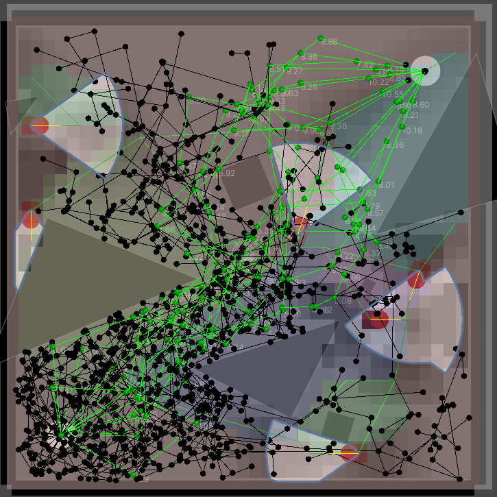
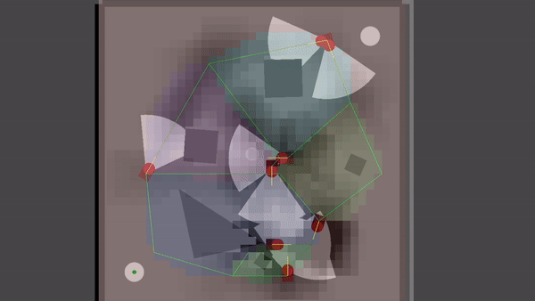

# Interactive search-based method for procedurally  generating stealth game level
## Introduction

Video Showcase - https://www.youtube.com/watch?v=Khpf0CbRgIY

This project is a Unity Editor tool designed to produce stealth level segments using an interactive evolutionary process. A stealth level is a rectangle area with static obstacles and dynamic, predictable dangers (patrols).  
The current implementation use a standard GA (Genetic Algorithm) and FI2-POP (Feasible Infeasible Population) to generate an array of stealth levels with a single click.

  

The purpose of this program is to aid level designers by offering visual feedback in multiple formats, such as enemy roadmaps, level zones, threat heatmaps, and the output of a level solver.
Below is the enemy roadmap (traversability) graph denoted by green segments and the different hues mark the different discretized regions used to form it (floodfill). The darker shade of black on each 
cell it the clustered value of each cells threat level in time.

  

Here are the how level solver outputs are visualized both in 2d and 3d. 

</img> </img> 

However, the better way of visualizing solution is to use move the Set Time variable in Future Level slider class.

  

## How to use
In its current form the code is no package and requires copying the source files into and existing Unity Project to use the functionalities. Interface Generation scene contains configuration for both genetic algorithms that can be run from the get go. RRT performance scene is mainly used for comparing the performance of level solvers implementations on a suite of user-picked levels. Measures from loggers are outputted in Tests folder.

### Level Evaluation
#### Validation
Generated level will be either feasible or not. Infeasible individuals will always have a fitness score of -100 and will be marked infeasible if they do not satisfy any of the validator objects:
 - A* Geometrical Path To End  -> false if level is traversable without interactive with enemies
 - A* Safe Path To End -> false if there exists a path that does not interact with dynamic threats
 - Start/End Observe Time -> false if count of frames in which start or goal positions are observed is more than X
 
 #### Subjective Score
Based on a synthetic user preference model, a list of weights for the rewards or penalties of specific level features.
Weights can be manually modified as well as dynamically adapted from simply selecting prefered level in a generation. *(Relevant classes: Interactive Evaluator Mono, User Preference Model)*

 Currently implemented level properties
 - Clutter
 - Zone Area Variance
 - Enemy Path Variance
 - Relative Level Coverage
 - Relative FOV Overlap)
 
 #### Objective Score
Runs several implementations of Rapidly Exploring Random Tree (RRT) algorithms with kinematic limitations in a batch. A final score is calculated by combining a batch's success rate with heuristics for each path, such as predicted risk and path uniqueness. The objective evaluator could be regulated by setting a success and risk target rate. *(Relevant classes: Level Engagement Evaluator, RRT, FieldOfViewRiskMeasure)*

## Dependencies
Tested On Unity Version -- 2021.3.1f1
CGALDotNet (https://github.com/Scrawk/CGALDotNet) - C# wrapper for CGAL
A fork of GeneticSharp (https://github.com/giacomelli/GeneticSharp) - Evolutionary base adapted for Unity Editor application

> Written with [StackEdit](https://stackedit.io/).